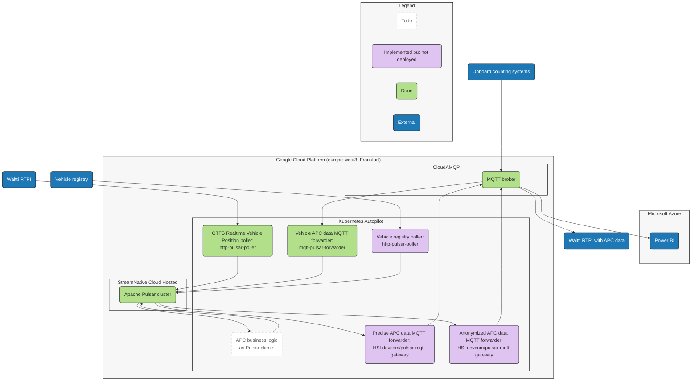
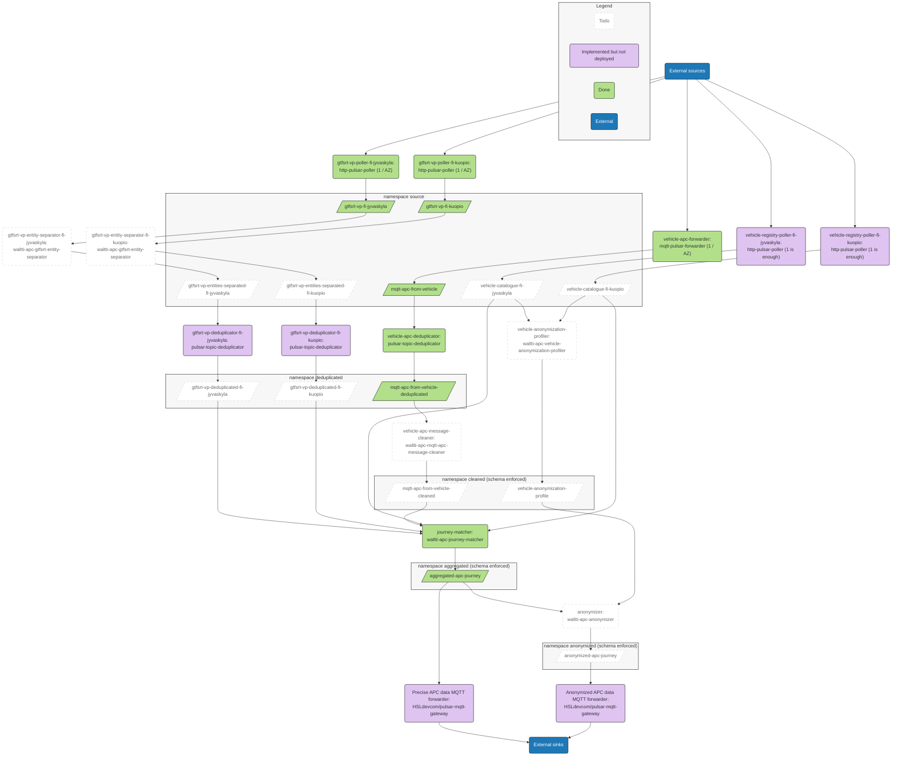

# waltti-apc

The automatic passenger counting (APC) pilot for Waltti.

This main repository documents the high-level structure of the project, links to the other repositories of the project and contains the issues and the Kanban board.

## Architecture

### High-level architecture

### Pulsar usage

Later on, we might switch from a separate MQTT broker onto MQTT-on-Pulsar (MoP).
MoP seems like a fairly capable MQTT broker that persists every MQTT message onto Apache Pulsar automatically.

## Other repositories

[http-pulsar-poller](https://github.com/tvv-lippu-ja-maksujarjestelma-oy/http-pulsar-poller) polls an HTTP endpoint, e.g. a GTFS Realtime API, and sends the data into Apache Pulsar.

[mqtt-pulsar-forwarder](https://github.com/tvv-lippu-ja-maksujarjestelma-oy/mqtt-pulsar-forwarder) forwards messages from the MQTT broker to the Apache Pulsar cluster.

[pulsar-topic-deduplicator](https://github.com/tvv-lippu-ja-maksujarjestelma-oy/pulsar-topic-deduplicator) forwards only the unique messages from Pulsar topics to another Pulsar topic.

[waltti-apc-aggregation-test-data-generator](https://github.com/tvv-lippu-ja-maksujarjestelma-oy/waltti-apc-aggregation-test-data-generator) generates APC aggregation test data into Pulsar.

[waltti-apc-analytics-db-schema-migrator](https://github.com/tvv-lippu-ja-maksujarjestelma-oy/waltti-apc-analytics-db-schema-migrator) creates and maintains the Waltti APC analytics database schema.

[waltti-apc-analytics-db-sink](https://github.com/tvv-lippu-ja-maksujarjestelma-oy/waltti-apc-analytics-db-sink) forwards aggregated APC data into the analytics database.

[waltti-apc-anonymization-plan](https://github.com/tvv-lippu-ja-maksujarjestelma-oy/waltti-apc-anonymization-plan) describes the anonymization approach to be used for the GTFS Realtime API.

[waltti-apc-deployment](https://github.com/tvv-lippu-ja-maksujarjestelma-oy/waltti-apc-deployment) provisions, configures and deploys the services for the Waltti APC backend.

[waltti-apc-gcp-terraform](https://github.com/tvv-lippu-ja-maksujarjestelma-oy/waltti-apc-gcp-terraform) builds GCP infrastructure with Terraform.

[waltti-apc-journey-matcher](https://github.com/tvv-lippu-ja-maksujarjestelma-oy/waltti-apc-journey-matcher) matches APC messages from the vehicles with GTFS Realtime messages to augment the APC messages with vehicle journey metadata.

[waltti-apc-pilot-analysis](https://github.com/tvv-lippu-ja-maksujarjestelma-oy/waltti-apc-pilot-analysis) analyzes the pilot results.

[waltti-apc-pilot-spec](https://github.com/tvv-lippu-ja-maksujarjestelma-oy/waltti-apc-pilot-spec) contains the technical specifications for the pilot partners, i.e. the vendors who create the onboard counting devices.
